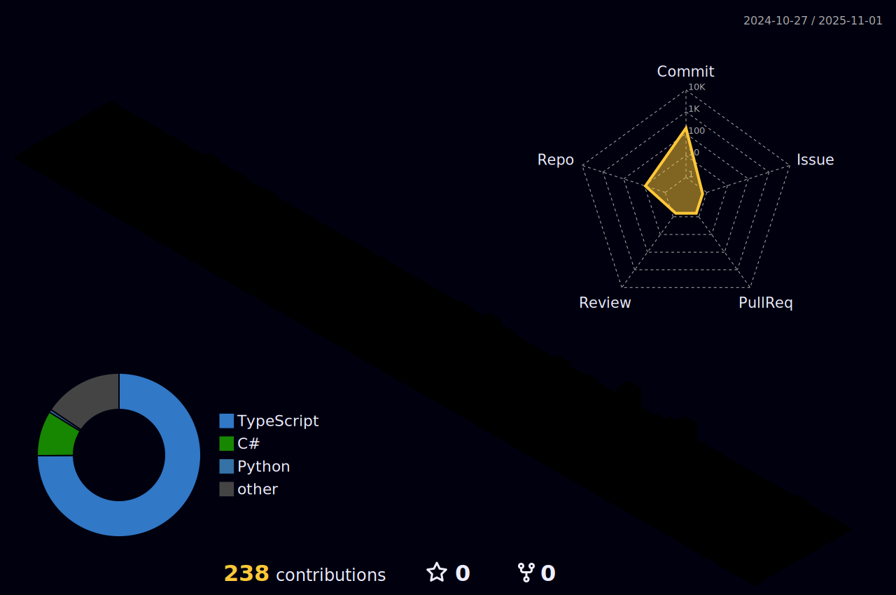

<h1 align="center">🧑‍💻 Jex Ugaz</h1>
<h3 align="center">Full Stack Developer | Cloud Architect | Telecommunications Engineer</h3>

  
  
  

## 🚀 About Me

Passionate about building mobile and cloud-native solutions. I specialize in backend development and creating seamless user experiences through clean code and scalable architectures. Here's what I focus on:

- 📱 **Mobile Dev** - Kotlin | React Native  
- 🌐 **Full-Stack** - React | Node.js | Spring Boot  
- ☁️ **Cloud Solutions** - AWS | GCP  
- 🛠️ **Backend Focus** - APIs | SQL/NoSQL | Microservices  
- 🚀 **Building** - Scalable apps | Clean code | Performance  
- 🌱 **Learning** - Cloud patterns | Advanced Kotlin  

## 🛠️ Technical Skills

### ☁️ Cloud & DevOps

### 💻 Programming Languages

### 🖥️ Frameworks & Libraries

### 🗃️ Databases

## 📚 Certifications
- Machine Learning for Industry - FABRICUM, PUCP (2025)
- Power BI for Management - PUCP (2023)
- English as a Foreign Language - B2 CEFR (2024)

## 📫 Let's Connect!
- 📧 Email: loammi.jezreel@gmail.com
- 📞 Phone: +51 970 149 453
- 💼 LinkedIn: [Loammi Jezreel Ugaz Manayay](https://www.linkedin.com/in/lugazmlink/)
- 🌍 Location: Lima, Perú

